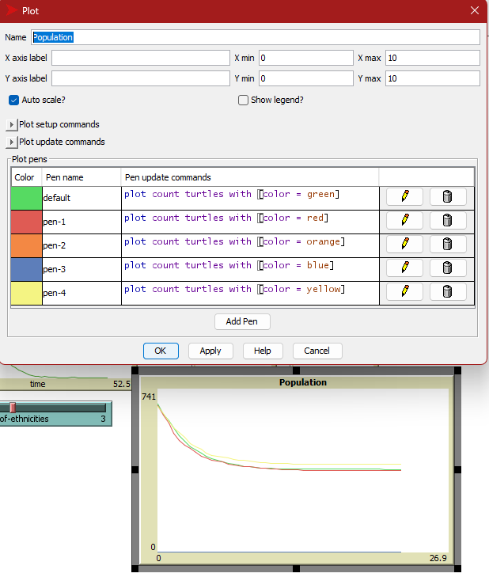
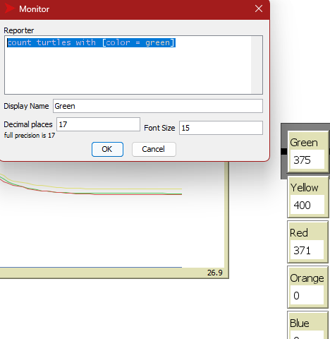

## Комп'ютерні системи імітаційного моделювання
## СПм-22-6, **Старов Олексій Євгенович**
### Лабораторна робота №**2**. Редагування імітаційних моделей у середовищі NetLogo

 

### Варіант 8, модель у середовищі NetLogo:
[Segregation Simple Extension 1](http://www.netlogoweb.org/launch#http://www.netlogoweb.org/assets/modelslib/IABM%20Textbook/chapter%203/Segregation%20Extensions/Segregation%20Simple%20Extension%201.nlogo), Додати можливість агенту зникнути, вірогідність чого залежить від кількості наявних поряд з ним "чужих" і кількості представників їхньої групи у їх власному оточенні. Виводити графік зміни розміру популяції.

 

### Внесені зміни у вихідну логіку моделі, за варіантом:

Додано нову змінну *turtles-own*:
<pre>
  enemy-nearby   ;; how many enemy patches have a turtle?
</pre>
Та розроблено логіку розрахунку у процедурі **update-turtles**:
<pre>
  ;; count enemies
  set enemy-nearby (total-nearby - similar-nearby)
</pre>
Додано змінні *turtles-own*:
<pre>
  ally-percent
  enemy-percent
</pre>
Та розроблено логіку підрахунку процентажу союзників та противників у процедурі **update-turtles**:
<pre>
;; percentage allies
set ally-percent (ifelse-value total-nearby != 0 [((similar-nearby / total-nearby) * 100)] [0])
;; percentage enemies
set enemy-percent (ifelse-value total-nearby != 0 [((enemy-nearby / total-nearby) * 100)] [0])
</pre>
Додано змінну *turtles-own*:
<pre>
surrounded?
</pre>
Задіяв створені раніше змінні для обчислення значення *оточеності*:
<pre>
set surrounded? ally-percent < enemy-percent
</pre>
Та розроблено логіку вбивства оточених черепах у новій процедурі **kill-surrounded**:
<pre>
to kill-surrounded
  ask turtles with [ surrounded? ] [
    if random 10 = 1 [ die ]       ;; 10% chance that surrounded turtle will be killed
  ]
end
</pre>
Додано графік зміни розміру популяції:

Скріншот моделі в процесі симуляції:

 

### Внесені зміни у вихідну логіку моделі, на власний розсуд:
Додано лічильник черепах:

Додано підрахунок вбивств:

<pre>
set count-kill number - count turtles
</pre>

А також лічильники кожного кольору:

Скріншот моделі в процесі симуляції:

 

## Обчислювальні експерименти
### 1. Вплив бажаної кількості однакових черепах на кількість вбивств
Досліджується залежність показника **Killed** від керуючого параметру **%-similar-wanted**.
Значення керуючих параметрів за замовчуванням:
- **number-of-ethnicities** 5
- **number** 2000

<table>
<thead>
<tr><th>%-similar-wanted</th><th>Кількість вбивств</th></tr>
</thead>
<tbody>
<tr><td>10</td><td>896</td></tr>
<tr><td>25</td><td>504</td></tr>
<tr><td>50</td><td>515</td></tr>
<tr><td>75</td><td>1344</td></tr>
<tr><td>100</td><td>1677</td></tr>
</tbody>
</table>

Графік наочно показує, що при занадто низькому показнику необхідних союзників - бродячі вороги (випадково) оточують та вбивають черепах. А при занадто високих параметрах показнику - був надто високий шанс блукаючи потрапити у пастку та бути оточеним та вбитим.
